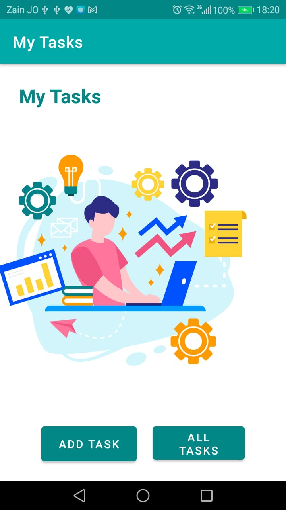

# my Tasks App

## home page 
- Here is the **home page** of the myTask app, it contains two buttons:
   - **Add Task** : move to the Add Task page.
   - **All Tasks** : move to the All tasks page.  
    

### After the editing in lab27:   
   - username section.  
   - three buttons for three different tasks.  

- The menu that have the settings item.  

  

### After the editing in lab28:
   - add a recyclerView to view 4 tasks.
   - you can click on the task item, and it will appropriately launch the detail page with the correct Task title displayed.  
  
  

### After the editing in lab29:
   - Displaying all the tasks records from the task table in the database.  
   
  

### After the editing in lab31:
- I did espresso testing for this page.

## Add Task page
- Here is the **Add Task** page that contains two text fields to add the task name and description.
- And there is a submit button **(add Task)**, it is increase the total number of tasks and show it at the bottom, and show a toast message that contains **"submitted!"** text.
- And the Back button to go back to the home page.

   

### After the editing in lab31:
- I did espresso testing for this page.

## Increase the total
- Here is the total increased after i clicked on the **add Task** button.

## Toast message "submitted!"
- Here is the message that appeared when i clicked on the **add Task** button.

## All Tasks page
- Here is the All Tasks page that contain an image.
- And the Back button to go back to the home page.

  

### After the editing in lab31:
- I did espresso testing for this page.

## Settings page  
- Here when the user enters his username and click the save button the username will be saved in a shared preference and we can access this username everywhere inside the application.  
- And a toast message will appear to tell the user that the username is saved.
- If the user didn't enter anything the button will be disabled.  
- If the user starts typing the button will be enabled.  

    

    

   

### After the editing in lab31:
- I did espresso testing for this page.

## Task Detail page  
- This is the task Details page that have a simple image and random text for the task description.  
- And i added the title of the task in the header.  

     

     

    

### After the editing in lab29:  
- display the task description and state in addition to the title.  

  

  

### After the editing in lab31:  
- I added the task title in the top of the task description.  
- I did espresso testing for this page.

